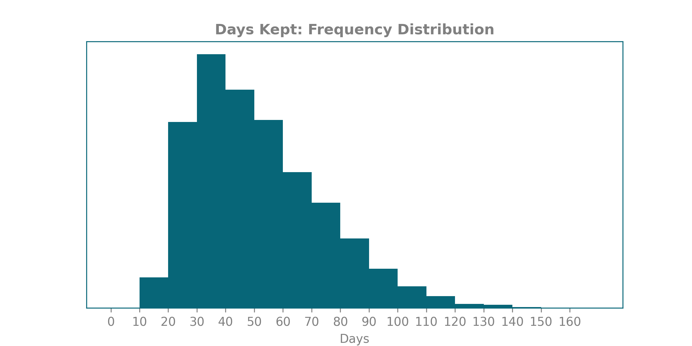
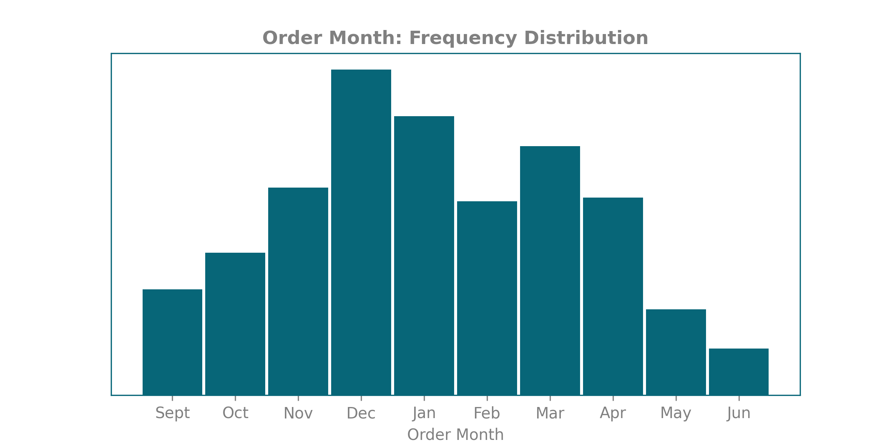
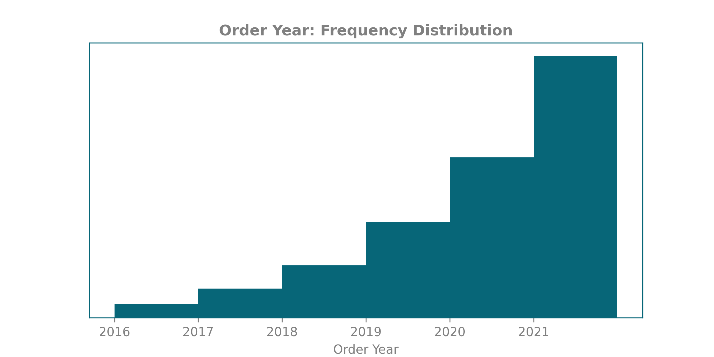
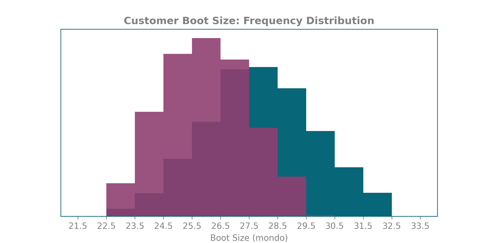
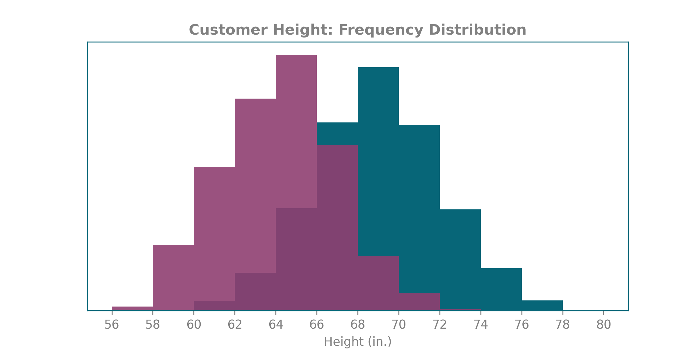
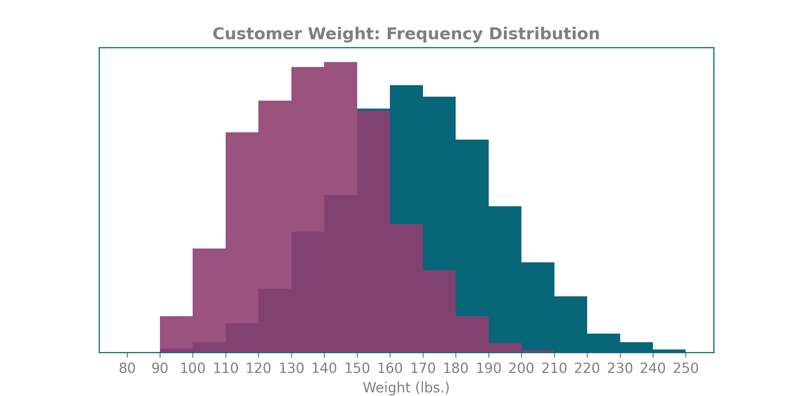
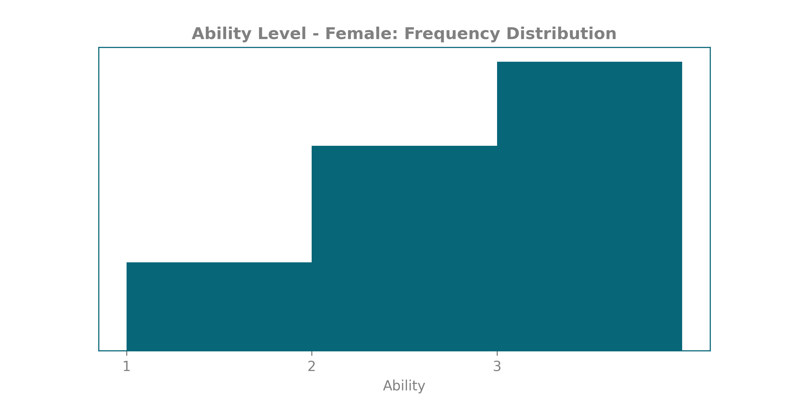

# Karve Sample Database
The algorithms in these python scripts generate highly realistic business data to populate all *operational* tables in Karve, including Customer, Rental, Damage, Mounted Ski, Ski, and Binding.

It generates realistic distributions *not only* for existing measures, but also for measures that will be derived in the future, such as the number of days customers keep skis 
before swapping them, the amount and type of damage entries that get recorded in the Damage table when a rental ski is returned from a customer, or the probability that a ski will be rented based on which brand it was made by.

It even distributes the probability of a ski being rented based on when it was purchased and mounted. For example, once a ski is 2 years old, we will un-list it from our site and keep it on hand in case of inventory shortages, and let customers use it when newer models are already in use. So, its likelihood of being rented during year 3 is very low.

### Here are some visualizations of the data:

[]()
[]()
[]()
[]()
[]()
[]()
[]()

### Notes for running scripts:
```main_driver.py``` is the file to configure and run.

New data is loaded into CSV files stored in ```/karvedata```.

If you configured main to load data for customers, skis, AND rentals, it will document the output as a new "build" and update ```build_info.txt``` with the latest version number and descriptive info. It will also automatically update the plots in ```/plots```.

Time complexity is linear for loading Customers and Ski/Binding/MountedSki. HOWEVER, time complexity to compute new Rental events depends on the ratio of mounted skis to rental events. Remember, the algorithm needs to place each rental event at a time that doesn't conflict with the customer or ski's previous rentals. So, for example, if you tell it to generate 30,000 rental events over 5 years with only 200 mounted skis available for rental, where skis are kept for around 30 days at a time on average, the program will obviously NOT work. But if you tell it to generate 1000 rental events, given 1000 mounted ski pairs to work with, it will run linearly without a problem.
